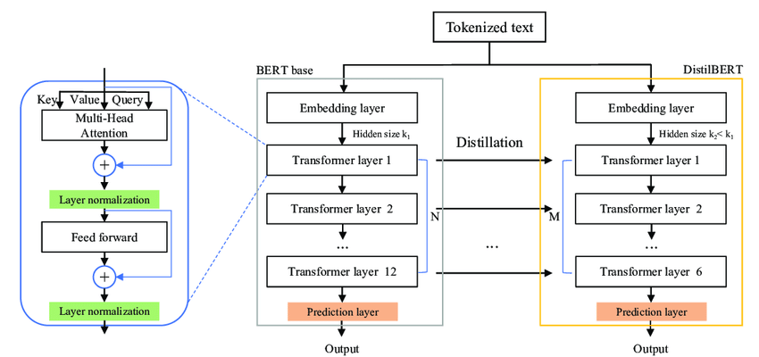
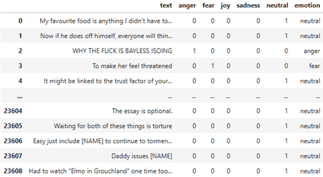
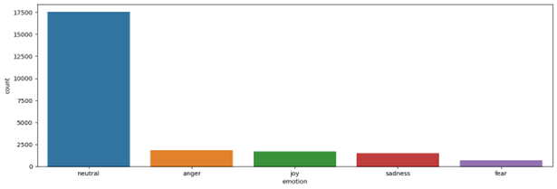
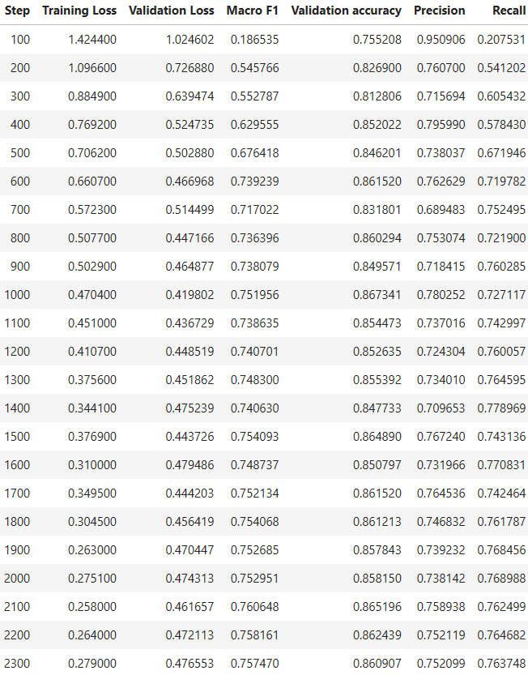
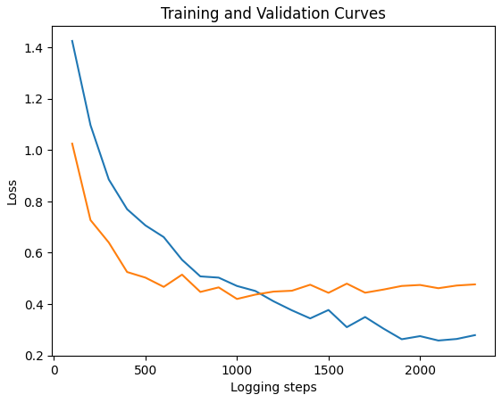
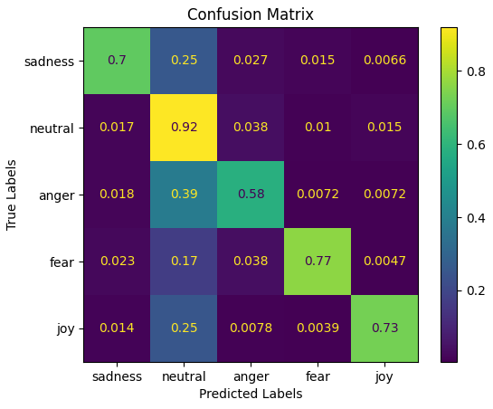

# Introduction

Emotion recognition and classification in the text is a rapidly evolving field within Natural Language Processing (NLP). The ability to understand and interpret human emotions in textual data has far-reaching implications for various applications, such as sentiment analysis, empathetic chatbots, mental health support systems, and monitoring online behaviour. In recent years, advancements in deep learning models have resulted in significant improvements in the performance of emotion classification tasks, enabling machines to better comprehend and respond to human emotions. 

In this repo, we present an emotion classification model based on DistilBERT, a more efficient and light-weigt version of the popular Transformer-based language model BERT. Our model is designed to perform a downstream NLP task that involves identifying and categorizing emotions expressed in text as one of predefined emotion classes. 

# Model

## Model Design

The goal of our project is to encode contextual information and capture the semantic meaning of sequential data in text. By leveraging the power of transfer learning, our model capitalizes on the powerful feature extraction capabilities of the pre-trained DistilBERT, a highly optimized and compressed variant of the original BERT model, which has been fine-tuned on large-scale corpora. The DistilBERT serves as the backbone of our model and is employed to extract a deep contextual representation of the textual data. This contextual representation is then fed into a linear classifier, which serves as the head of our model. The linear classifier facilitates the prediction of the emotional category of the input text by mapping the contextualized features into a corresponding emotion label. Our model is trained and evaluated on a modified dataset of text samples from Reddit comments, labeled with one of 5 emotion catagories: "Angry", "Fear", "Joy", "Sadness" and "Neutral". 

 DistilBERT

Specifically, our model contains the following components:

1. Input Embedding Layer: The input text is tokenized and converted into a sequence of token IDs, which are then passed to the input embedding layer. This layer maps token IDs to continuous vectors, also known as word embeddings. Positional encodings are added to these word embeddings to capture the position of each token in the input sequence.
2. Transformer Layers: DistilBERT uses a series of Transformer layers, which are composed of multi-head self-attention mechanisms and position-wise feed-forward networks (FFN). The self-attention mechanism allows the model to focus on different parts of the input sequence and captures the relationship between tokens. The output from the multi-head self-attention is then passed through the position-wise FFN, which applies a non-linear transformation to each token's representation independently.
3. Layer Normalisation and Residual Connections: After each Transformer layer, there is a layer normalisation step to stabilise and accelerate training. Residual connections are used in combination with layer normalisation to help the model retain information from previous layers.
4. Pooling and Classification Layer: After passing through all Transformer layers, the output of the last layer is pooled to obtain a fixed-size vector representation of the input text. This pooled output is then fed into three fully connected layer with ReLU activation function and two dropout layers, which outputs a probability distribution over the 5 emotion classes.

 Model Architecture

The forward pass computation in the model consists of tokenizing and embedding the input text, processing the embeddings through the Transformer layers, and finally generating a probability distribution over the emotion classes using the pooled output and the classification layer. The model's predictions are based on the emotion class with the highest probability. By understanding the steps involved in the model computation, we ensure that we do not treat the model as a black box and have a better grasp of its inner workings.

## Model Parameters

Our model consists of over 66 million parameters. The pre-trained DistilBERT model from Huggingface contains around 66 million parameters. Our three fully-connected layer have 98000, 8000 and 320 parameters respectively. The parameterof the pre-trained DistilBERT model is fixed while the three fully-connected layers we added in our model can be fine-tuned. After careful consideration, we propose that configuring the fully-connected layers with 128 and 64 neurons would be optimal for our model.

## Model Examples:

Successful example: 

* What a god 

Expected prediction: neutral 

Actual prediction: neutral 

Unsuccessful example: 

* gaslighting!!!!! he’s manipulative 

Expected prediction: neutral 

Actual prediction: anger

# Data

The data we used in our analysis is an adapted version of the GoEmotions dataset, which was originally compiled by Google Research and contains human-annotated emotion data for analysis purposes. This dataset comprises 58,000 comments from Reddit, each labelled with one of 28 emotion categories. The GoEmotions dataset is publicly available on its official GitHub repository (GitHub) under the Apache License 2.0, which grants us permission to use, modify, and further develop the data for any purpose, including commercial use, provided we give credit appropriate credit.

 Data Example

Given the vast range of categories provided by the dataset and the potential for ambiguity within them, such as a sentence containing both "approval" and "admiration," which may be subjectively interpreted by human annotators and be labeled as any one of them, we opted to mitigate this issue by avoiding emotions with potential associations and instead selecting 5 distinct categories to reorganize and refine the dataset. Following the dataset reorganization, each category contains the following number of samples: 'neutral': 17541, 'anger': 1845, 'joy': 1709, 'sadness': 1508, and 'fear': 709. 

For the Train/Test Split, we will randomly allocate 30% of the data for the test set using the train_test_split function, which is a very common ratio. A further 20% of the remaining data will be reserved for the validation set, with the remainder utilized for training.

 Data Distribution

Additionally, we acknowledged the significant problem of data imbalance within the original and newly created dataset, with some categories having a disproportionate number of samples compared to others, particularly "neutral". As a result, we incorporated data augmentation techniques during training to increase the sample size of non-"neutral" text inputs and alleviate the issue of data imbalance.

We utilized TextAttack to expand our training sample by augmenting a series of texts within the training dataset. This approach served to enhance model generalization and alleviate data imbalance. Our data augmentation strategy included synonym swapping, character replacement, word contraction, and random word expansion, all of which were carried out through TextAttack’s API. These techniques yielded training examples that were comparable to the original samples, but with enough variation to enable the model to learn new features.

Example:

* Original: "This university is the best institution known to mankind, I don't want to graduate."

* Augmented: ["This college is the exemplary institution known to mankind, I don't want to graduate."]

For further details, please refer to the visualization and code in our notebook.

# Training

Throughout the process of fine-tuning our model, we explored various strategies to enhance its performance, ultimately arriving at our current approach. Initially, we endeavored to determine the optimal configuration for our fully-connected layer by experimenting with different layer sizes and numbers. Initially, we presumed that at least two layers were necessary and that a descending order of layer sizes from 128 to 32 was most effective. However, we ultimately discovered that the last 32-layer did not yield any improvements, and thus, we settled on using 128 and 64 layers.

Additionally, we addressed the issue of data imbalancing by testing two loss functions: weighted loss function and focal loss function with alpha weighting. Unfortunately, these approaches failed to resolve the imbalance issue, and therefore we employed data augmentation while retaining the standard cross-entropy function. In addition, we tackled the problem of severe overfitting by experimenting with dropout rates and implementing batchnorm layers. However, the latter did not produce significant improvement results as dropout layers are typically used in natural language processing tasks, whereas batchnorm layers are better suited to computer vision problems. Ultimately, we found that using a higher dropout of 0.2 proved to be more effective.

We also attempted to address the overfitting problem through L1/L2 regularization, but unfortunately, this approach produced negligible results and adversely affected our validation accuracy. Consequently, we chose to employ the weight decay parameter in the Huggingface Trainer class, which proved to be more effective in mitigating overfitting. Most of our tuning processes were performed within the Trainer class of Huggingface, which utilizes the AdamW optimizer, featuring weight decay and momentum. For this optimizer, we could adjust the parameters such as epsilon, learning rate, weight decay, and momentum. We discovered that tuning the epsilon value from the default 1e-8 had positive effects on our model's performance. Similarly, the initial learning rates we tested, such as 0.01 and 0.001, proved to be too high for our model, and we ultimately settled on a learning rate of 1e-5, which was very close to the default value of 2e-5. We retained the default value of 0.9 for momentum, as it had performed well in previous studies. Lastly, we experimented with different weight decay values, settling on 0.0001 to mitigate our model's overfitting.

Finally, while we prepared an early-stopping mechanism, it was not utilized, as the Trainer class automatically loaded the best model.

 Training Log

 Training Curve

# Results

<table>
  <tr>
   <td>
   </td>
   <td>Precision
   </td>
   <td>Recall
   </td>
   <td>f1-score
   </td>
   <td>Support
   </td>
  </tr>
  <tr>
   <td>Sadness
   </td>
   <td>0.74
   </td>
   <td>0.70
   </td>
   <td>0.72
   </td>
   <td>452
   </td>
  </tr>
  <tr>
   <td>Neutral
   </td>
   <td>0.91
   </td>
   <td>0.92
   </td>
   <td>0.91
   </td>
   <td>5263
   </td>
  </tr>
  <tr>
   <td>Anger
   </td>
   <td>0.59
   </td>
   <td>0.58
   </td>
   <td>0.59
   </td>
   <td>553
   </td>
  </tr>
  <tr>
   <td>Fear
   </td>
   <td>0.71
   </td>
   <td>0.77
   </td>
   <td>0.73
   </td>
   <td>213
   </td>
  </tr>
  <tr>
   <td>Joy
   </td>
   <td>0.81
   </td>
   <td>0.73
   </td>
   <td>0.77
   </td>
   <td>513
   </td>
  </tr>
  <tr>
   <td>
   </td>
   <td>
   </td>
   <td>
   </td>
   <td>
   </td>
   <td>
   </td>
  </tr>
  <tr>
   <td>Accuracy
   </td>
   <td>
   </td>
   <td>
   </td>
   <td>0.86
   </td>
   <td>6994
   </td>
  </tr>
  <tr>
   <td>Macro avg
   </td>
   <td>0.75
   </td>
   <td>0.74
   </td>
   <td>0.74
   </td>
   <td>6994
   </td>
  </tr>
  <tr>
   <td>Weighted avg
   </td>
   <td>0.86
   </td>
   <td>0.86
   </td>
   <td>0.86
   </td>
   <td>6994
   </td>
  </tr>
</table>

Our results indicate that the applied method exhibited satisfactory performance considering the inherent complexity of the task. The proposed model demonstrated an overall accuracy of 0.86 and f1-scores spanning from 0.59 to 0.91 for various emotional categories. These outcomes suggest that the model was capable of accurately recognizing and categorizing emotions in text to a considerable extent. 

The f1-scores for each emotional category provided additional insight into the model's efficacy. The f1-score is a metric that assesses a model's precision and recall simultaneously. A higher f1-score indicates that the model can precisely recognize instances of a particular emotional category while minimizing both false positives and false negatives. In this study, the model achieved relatively high f1-scores for most emotional categories, except for "Fear," which demonstrated a lower f1-score. This implies that the model was able to accurately identify and classify most emotions in the text but may have experienced some difficulty with the "Fear" category. This performance could be attributed to the relatively smaller data size of the "Fear" category and the fact that it is a very subtle emotion that is difficult to identify.

Furthermore, the precision and recall metrics for each emotional category also demonstrated commendable performance. For instance, the precision for the "Neutral" category was 0.91, implying that when the model predicted "Neutral," it was correct 91% of the time. The recall for the "Neutral" category was 0.92, indicating that out of all the genuine "Neutral" instances, the model correctly recognized 92% of them. We also fine-tuned the model by experimenting with different configurations for the fully-connected layers, testing various loss functions and data augmentation to address the data imbalance issue, and opting for a weight decay parameter in the optimizer to mitigate overfitting. 

Overall, given the complexity of emotion classification and the challenges posed by data imbalance and emotion ambiguity, we believe that our implemented method exhibited satisfactory performance. This performance can be attributed to factors such as our use of power DistilBERT as a feature extractor, careful selection and refinement of data, and thoughtful choices when it came to hyperparameters.

 Confusion Matrix

## Ethical Consideration

Given the implications of statistical modelling, it is important to consider and negate any ethical mishaps. Specifically, while developing our machine learning model for emotion classification, it is essential that we consider the ethical implications of this technology. The model's ability to accurately identify and classify emotions can be beneficial in various applications, such as customer service, mental health support, and monitoring online content for harmful behaviour. However, it is vital to address the potential risks and ensure the responsible development and deployment of this technology for any use case. We have devised the following ethical considerations:

* Privacy and Data Security: The GoEmotions dataset, which is derived from Reddit comments, raises concerns about privacy and data security. Although usernames are included in the raw data, we must ensure that no personally identifiable information (PII) is leaked or misused during the development and deployment of the model. It is crucial to anonymize and protect user data to prevent any unintended consequences.
* Bias and Fairness: As mentioned in the data introduction, the GoEmotions dataset exhibits an imbalance in the distribution of text across different emotion categories. This imbalance could lead to biassed results, where the model may be more accurate in identifying and classifying emotions that have more data points. It is crucial to address this issue by evaluating the model's performance on different emotion categories and refining the model accordingly. Moreover, it is essential to ensure that the model does not perpetuate harmful stereotypes or biases based on race, gender, religion, or other protected attributes.
* Misuse and Accountability: Emotion classification models have the potential for misuse in various scenarios, such as surveillance, manipulation, or censorship. It is vital to establish clear guidelines and policies to prevent the misuse of this technology and ensure that its deployment aligns with ethical principles. Additionally, establishing a framework for accountability and transparency in the development and application of the model is necessary to address potential concerns and prevent unintended consequences.
* Consent and Agency: When applying the emotion classification model in real-world scenarios, it is crucial to consider the issue of consent and individual agency. Users should be informed about the use of such technologies and have the option to opt-out or control how their emotional data is analysed and used.

In essence, the development of our emotion classification model comes with numerous ethical considerations. Ensuring responsible development and deployment of this technology requires addressing privacy, bias, fairness, misuse, accountability, and consent concerns. By considering these ethical aspects, we aim to create a model that respects user rights and contributes positively to the different applications of the technology.